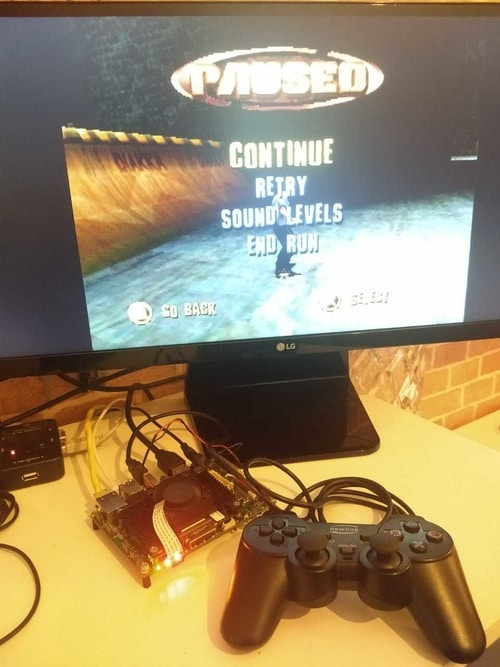

# Retroarch on Torizon #

This project intends to provide an easy way to have [Retroarch](https://www.retroarch.com/) running on Toradex boards using Docker containers. Retroarch is a frontend for emulators, and it can execute games for multiple platforms using game engines (libretro cores).

Currently, the only platform tested is :

- Toradex Apalis iMX8

We successfully tested the following libretro cores with a consistent performance:

- Sony Playstation (Beetle PSX) @ 60fps
- Sega Genesis/Mega Drive (PicoDrive)
- Nintendo SNES (Snes9x)
- Dos (DOSBox)



# Pre-requisites #

- A Toradex SoM with [Torizon installed](https://developer.toradex.com/getting-started/module-1-from-the-box-to-the-shell/installing-the-operating-system-torizon-ixora?som=apalis-imx8&board=ixora-carrier-board&os=torizon&desktop=linux). We currently only tested it with Toradex Apalis iMX8.

- A [Dockerhub account](https://hub.docker.com/signup). In your PC, use `docker login` to register your credentials

- An HDMI screen connected to the board

**Note:** Some emulators will require a console BIOS image file. You will also need the ROMs with the game images to execute. As we don't provide these files, we show how to bind mount a directory from your board, so you can included your files to these directories.


# For the impatient #

If you only want to play games without building from scratch, in your Toradex SoM's console, do the following:

Disable the pre-provisioned containers:

```
# sudo systemctl disable docker-compose
```

Reboot your board (You only need to do it once).

After the reboot, pull the pre-built container image from Dockerhub and deploy the container:

```
# docker pull denisyuji/retroarch-on-torizon && docker run -e ACCEPT_FSL_EULA=1 -it --rm --name=retroarch --net=host --cap-add CAP_SYS_TTY_CONFIG \
-v /dev:/dev -v /tmp:/tmp -v /run/udev/:/run/udev/ --device-cgroup-rule='c 4:* rmw' \
-v ~/ROM:/home/ROM -v ~/BIOS:/home/BIOS \
--device-cgroup-rule='c 13:* rmw' --device-cgroup-rule='c 199:* rmw' --device-cgroup-rule='c 226:* rmw' \
--device-cgroup-rule='c 81:* rmw' denisyuji/retroarch-on-torizon
```

**Note:** Put your BIOS and ROM files on the `/home/torizon/BIOS` and `/home/torizon/ROM` directories of the board using `scp` command. This directory will be bind mounted into the container.

# Building it from scratch #

In your PC, clone this repository:

```
$ git clone https://github.com/denisyuji/retroarch-on-torizon.git
```

Build the Docker image

```
$ cd retroarch-on-torizon
$ docker build -t <your-dockerhub-username>/retroarch-on-torizon . 
```

After the build, push the image to 'your Dockerhub account.

```
$ docker push <your-dockerhub-username>/retroarch-on-torizon
```

## Executing image ##

Connect to your board's terminal using ssh. Torizon comes with pre-provisioned containers. To kill it, send the following command in your board's terminal:

```
# sudo systemctl disable docker-compose
```

Reboot your board.

Pull your container from Dockerhub:

```
# docker pull <your-dockerhub-username>/retroarch-on-torizon
```

Finally, execute the container based on the image (adjust the command to your Dockerhub username):

```
docker run -e ACCEPT_FSL_EULA=1 -it --rm --name=retroarch --net=host --cap-add CAP_SYS_TTY_CONFIG \
-v /dev:/dev -v /tmp:/tmp -v /run/udev/:/run/udev/ --device-cgroup-rule='c 4:* rmw' \
-v ~/ROM:/home/ROM -v ~/BIOS:/home/BIOS \
--device-cgroup-rule='c 13:* rmw' --device-cgroup-rule='c 199:* rmw' --device-cgroup-rule='c 226:* rmw' \
--device-cgroup-rule='c 81:* rmw' <your-dockerhub-username>/retroarch-on-torizon
```

# Known issues

- The image includes other platforms' cores, but we didn't test it (Some of them will not work).

- No shaders / render on HW. CPU only. We plan to support HW 3D acceleration in the future (with Vulkan support probably).